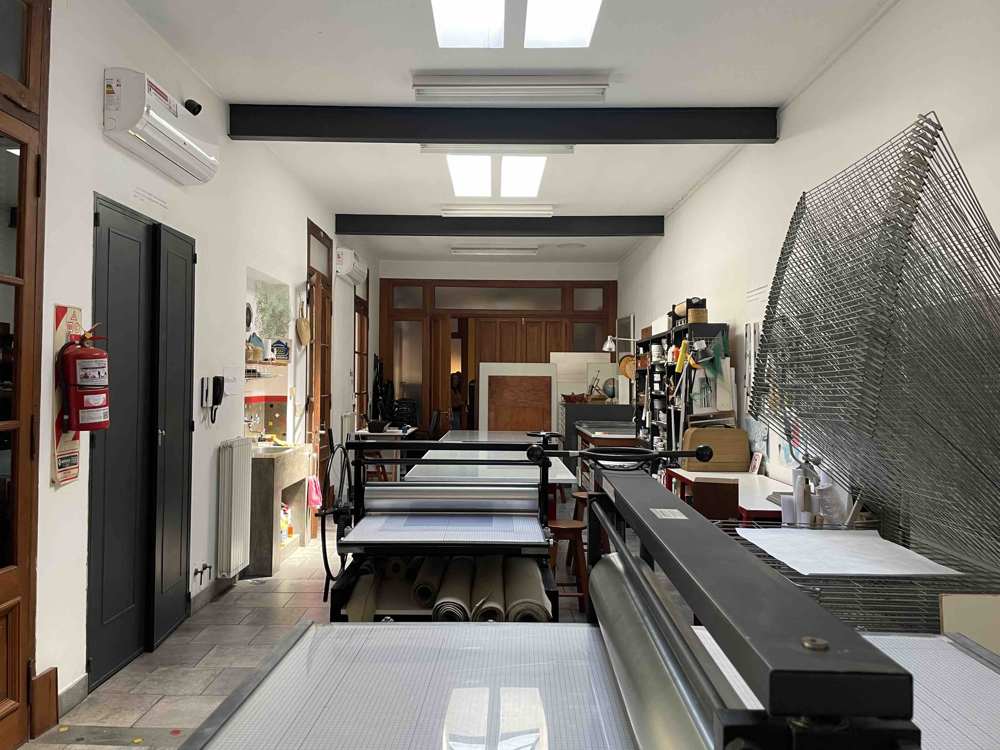
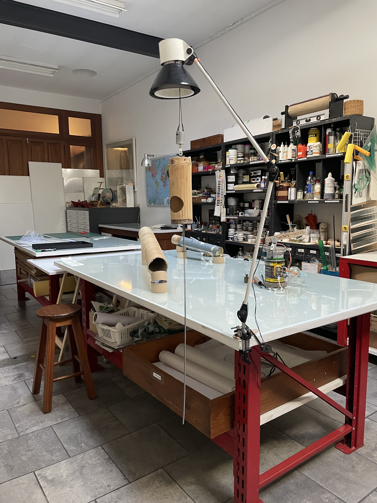
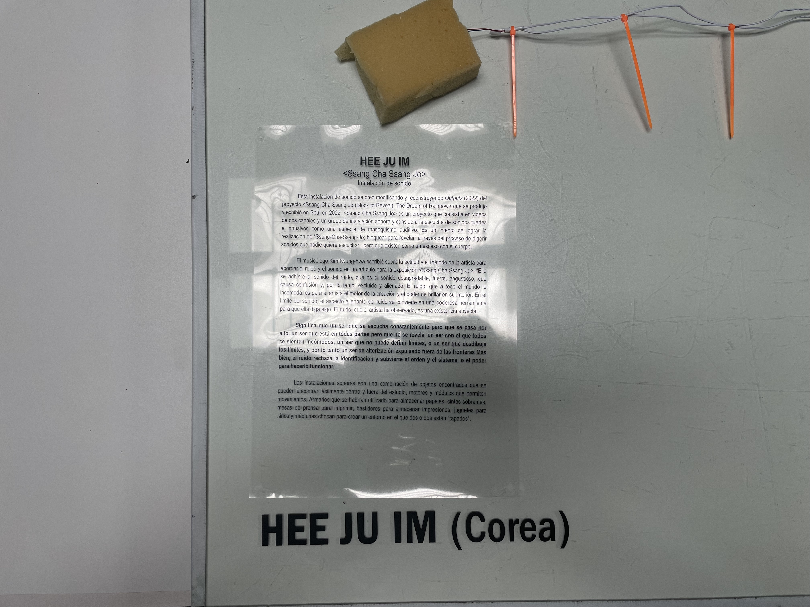

# *Outputs* (2022)

Rework of *Outputs* from the project [*Ssang-Cha-Ssang-Jo*](https://github.com/meek-as-a-lamb/Ssang-Cha-Ssang-Jo-2022) while Artist in Residence at ['ace](https://www.proyectoace.org/en/home-2/), Buenos Aires

[📼 Video Documentation and More of *Outputs* (2022)📢](https://www.proyectoace.org/en/artistas/hee-ju-im-2/)

Sound Installation Project / 소리 설치 프로젝트

Cupboards, Tube, Wooden Balls, Sponge, Ceramics, Cans, DC Motors, Vibration Motors, Stepper Motors, Node MCU, Batteries

 Printing Studio View at 'ace

© Hee-Ju Im

